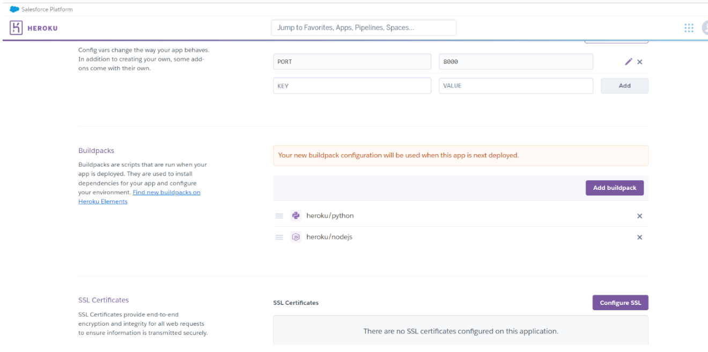

# General Knowledge Quiz: 3rd Project

   

## Introduction   

My third project is a General Knowledge Quiz. It's a small game for people who have the willingness to learn new things and like to test their knowledge.

 

[Visit the General Knowledge Quiz](https://general-knowledge-quiz-game-eabd9d6363af.herokuapp.com/)  

[Visit the General Knowledge Quiz Repository](https://github.com/KamilaAzul/General-Knowledge-Quiz-Game/blob/main/README.md)

     

# Contents

* [**User Experience UX**](<#user-experience-ux>)
    * [The Business Goals of the Website](<#business-goal>)
    * [User Stories](<#user-stories>)
* [**Features**](<#features>)
    * [Quiz Flow](<#quiz-flow>)
* [**Technologies Used**](<#technologies-used>)
    * [Functions](<#classes&functions>)
* [**Testing**](<#testing>)
* [**Deployment**](<#deployment>)
* [**Credits**](<#credits>)
*  [**Acknowledgements**](<#acknowledgements>)

## User Experience UX

I decided to use a background related to the theme of the game, which makes the quiz visually more pleasant to use.

 

### The Business Goal of the Website:

- Websie has no commercial goals. The site's goal is to provide an interactive quiz game to the users.
  
  

## User Stories

* As a user I want to understand how to play the game.
* As a user I want to choose the game difficulty level.
* As a user I want to play the game.
* As a user I want to see if my answer was correct.
* As a user I want at the end of the game see my score and the other users.
* Someone wants to be able to see the correct answers.
* As a user I want to have the possibility to play one more time.

[Back to top](<#contents>)

## Features

* User is welcome with the short welcoming message and short quiz instructions.
* User is asked to put the name.
* User is greeting “Good Luck” message,
* The user is asked what difficulty level he wants to choose.
* The quiz starts and the user can choose the answer A, B, C or D.
* If the answer is anything else (A, B,C or D)will be given, the user will see this message: "Wrong choice, the only options are A, B, C, or D"
* After answering, the user can see whether the answer was correct or wrong.
* After providing all the answers, the user can see his/her result.
* The user can see his/her answers and compare them with the correct answers
* The user can see the leaderboard with the top ten results.
* Once the game is completed a user will have an option to play one more time or to quit.

## Quiz Flow

The flowchart shows the entire cycle of the game and the planning process.

## Technologies Used

- [Python](https://www.python.org) is used as the back-end programming language.
- [GitHub](https://github.com) used for secure online code storage.
- [Gitpod](https://gitpod.io) is used as a cloud-based for game development.
- [Heroku](https://www.heroku.com) used for hosting the deployed back-end site.
- [HTML5](https://en.wikipedia.org/wiki/HTML5)
- [CSS3](https://en.wikipedia.org/wiki/CSS)

[Back to top](<#contents>)

## Functions

* The script includes some setup code at the beginning, such as importing necessary modules, setting up Google Sheets API credentials, and printing a welcome message. It uses the gspread library to interact with Google Sheets for leaderboard functionality. Additionally, it uses the colored and tabulate libraries for colorful console output and tabulating leaderboard data.

* The script defines two sets of questions and answers for easy and difficult levels. The questions are stored in dictionaries, and the corresponding answer choices are stored in lists.

### The primary functions used on this application are:

- `def start_game()`
This function initiates the quiz game. It begins by asking the user to choose a difficulty level using `choose_difficulty_level()`.  It presents questions depending on the chosen difficulty level, make validation of the user's responses, it calculates the score, and updates the leaderboard. Function displays the user's score, responses, correct answers, and the leaderboard.

- `verify_score(score, reply)` 
This function check a correct answer and the user's response, returns 1 if the response is correct and 0 otherwise. It also provides feedback to the user about the correctness of their response.

- `show_score(correct_responses, responses, questions, difficulty)` 
This function shows the user's score, percentage of correct answers, the user's responses, and the correct answers after completing the quiz.
- `def update_leaderboard(player_name, score, responses, difficulty)`  
This function updates the leaderboard with the player's name, score, and responses. 
- `def print_leaderboard(difficulty)` This function prints the leaderboard for the specified difficulty level. It prints the top 10 players with their scores.

- `def restart_game()` 
This function asks the user if they want to play again. If the response is 'YES', it returns True, allowing the game to restart. Otherwise, it breaks out of the loop, ending the game.

[Back to top](<#contents>)

### Future Features possible to implement:

* Game Progression- adding more question, creating different levels of difficulty.

[Back to top](<#contents>)

# Testing

I tested my project on [CI Python Linter](https://pep8ci.herokuapp.com) and as well with [Python Checker](https://www.pythonchecker.com/).

 

[Back to top](<#contents>)

## User stories testing:

* As a user I want to understand how to play the game.
    * Quiz is very simple to understand. Instruction about the choices is given to the player.
* As a user I want to choose the game difficulty level.
   * User can choose easy or difficult game level.
* As a user I want to play the game.
    * Quiz works with no problems.
* As a user I want to see if my answer was correct.
    * After answering, the player can see whether his answer is correct or not.
* As a user I want at the end of the game see my score and the other users.
    * After the last answer is given, the player's final score will be displayed in a table, together with the scores of the other best users.
* Someone wants to be able to see the correct answers.
    * At the end of the game, the user can see his/her answers and compare them with the correct answers.
* As a user I want to have the possibility to play one more time.
    * After answering all the answers, the player has the option to start the game again.

## Lighthouse validation

Deployed project was tested by the Lighthouse Audit tool to check for any major issues.

[Back to top](<#contents>)

 ## Deployment

  

 ### How to make a local Clone
1. Navigate to the main page of the repository.
2. Click the green Code Button at top right of the repository.
3. Copy the url for the repository.
4. Open Git Bash and Change the current working directory to where you want the cloned directory.
5. Type git clone, and then paste the URL you previously copied using $ git clone. 
6. Pressing enter will then create your clone.  

[Back to top](<#contents>) 

### How to fork a GitHub Repository
1. Log into GitHub and go to the required Repository.
2. The Fork button is at the top right corner of the page.
3. After clicking on this button the copy of the repository is made in your own GitHub account.  

 [Back to top](<#contents>)

 

### Deploying to Heroku
* Log in to Heroku,
* After login we can see the dashboard. To 'Create new app'
 Select 'New' and click 'Create new app'. 
* Pick a unique name for your app.
* Select your region and create your app.
* In the settings tab find the config vars section 
* Pick 'Reveal config vars',
* Add  'PORT' into the key field and added '8000' into the value field and click 'add'.
* In case you have credentials, for your project, you must create another config vars called 'CREDS' 
* Paste the JSON into the value field.
* In the builldpacks section click 'add buildpack'.
* Add  'Python' and 'save changes, 
* Repeat the process with 'Node',

 

 

* Go to the Deploy tab and select 'github',
* Confirm connection to your GitHub Account.
* Search for your project repository and click to 'connect'.
* Under the deploy options, you can chose automatic deploys, 
* Choose which branch you want to deploy and click on 'Deploy Branch'.
*  After some time the app is ready,  and we can open the app by using the provided link.

 

  

[Back to top](<#contents>)

# Credits

* The base for the code comes from this tutorial [YouTube tutorial](https://www.youtube.com/watch?v=yriw5Zh406s).
* This tutorail was very helpful as well [YouTube tutorial](https://www.youtube.com/watch?v=DLn3jOsNRVE&t=1147s).
* The inspiration for Read me file came from this repository on [GitHub](https://github.com/shadeofpurple79/flickers-smarticles/blob/main/README.md?plain=1).

 I also used the following online resources:

* [Code Institute](https://codeinstitute.net/ie/)
* [Slack](https://slack.com/intl/en-ie/) 
* [W3Schools.com](https://www.w3schools.com/)

 ## Acknowledgements

The quiz was completed as a Portfolio Project 3 made for the Full Stack Software Developer (e-Commerce) Diploma at the Code Institute.

I would like to thank all at the Code Institute for their help and support.
[Back to top](<#contents>)
